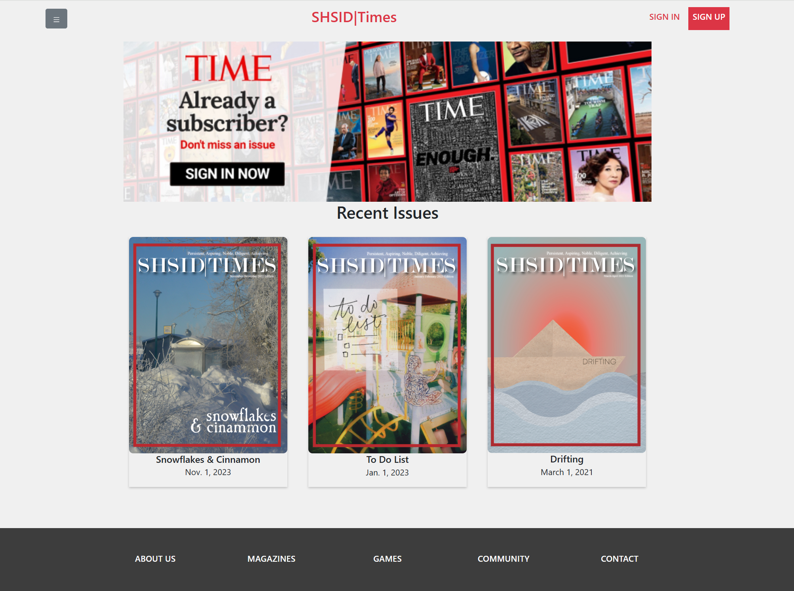
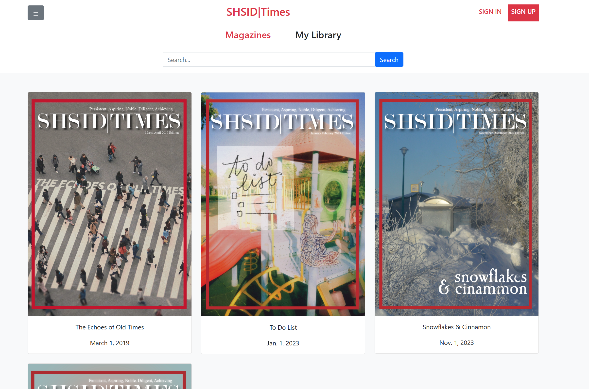
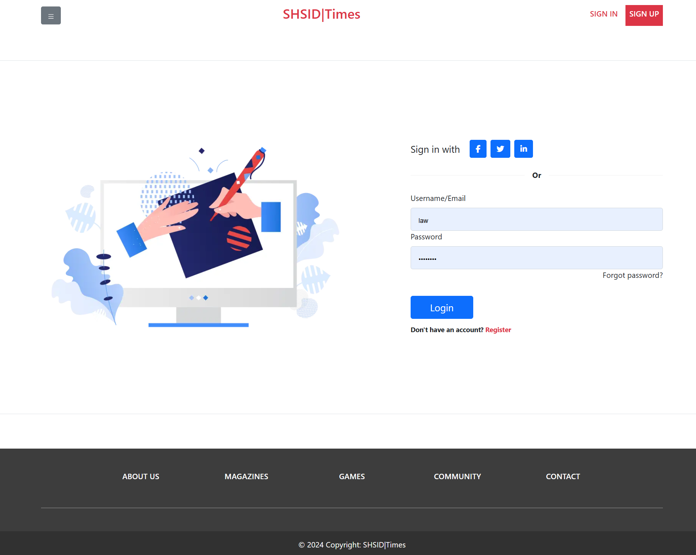
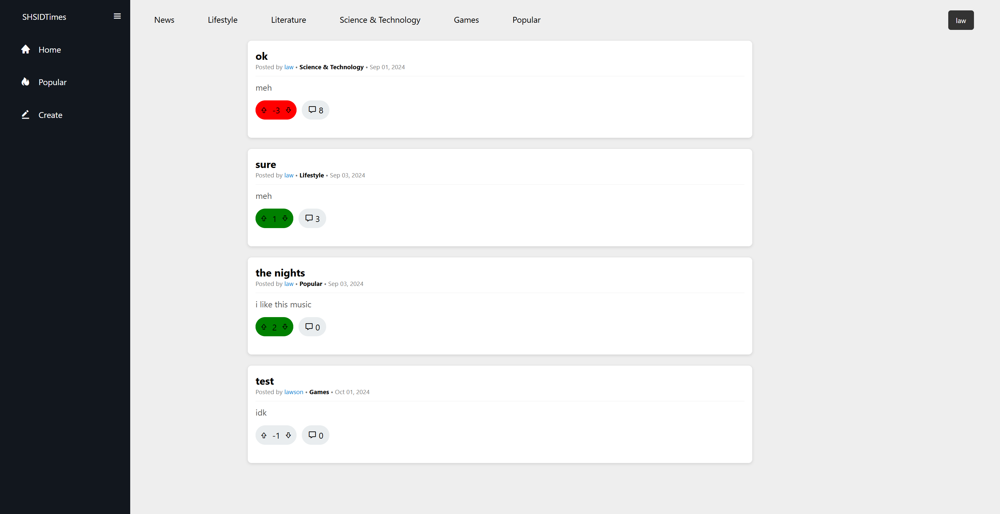

# TimesWebsite
## 📖 Overview

**TimesWebsite** is a website that digitalizes SHSID Times Magazines, providing users online access to view, download, or bookmark magazines. 

Each magazine also has its own forum, allowing users to discuss about each magazine, and sharing their thoughts separately. 

This project addresses the underutilization problem of the magazines when they were only placed in the school library.

## 🚀 Features

- 📚 Magazine viewing, downloading, bookmarking  
- 💬 Discussion forum for each magazine issue  
- 🔐 User authentication system (register / login / logout)  
- 🗂 Organized magazine archive system  

## 🛠 Tech Stack

- **Backend:** Django (MVT architecture)  
- **Database:** SQLite3  
- **Frontend:** HTML, CSS  
- **Authentication:** Django built-in user authentication system  

## 🖼 Screenshots

### Homepage


### Magazine View Page


### Login Page


### Forum Page



## 🧠 What I Learned

This project strengthened my understanding of full-stack web development, covering:

- Frontend interface design and implementation  
- Backend logic development using Django’s MVT framework  
- Database modeling and integration  
- Connecting frontend templates with backend views  
- Implementing authentication and user session management  

As team leader, I learned the importance to plan the entire project timeline out in the beginning to foresee challenges we might face, which can be better addressed during the actual implementation period.

## 🔮 Future Improvements

- 📱 Package into mobile application  
- 📧 Email notifications for new magazine releases and forum updates  
- 🎮 Integrate mini-games related to magazine content to increase engagement  

## 💡 Motivation

The core motivation behind TimesWebsite was to enhance accessibility and engagement with school publications. By transforming static physical magazines into an interactive digital platform, this project aims to encourage greater participation and discussion within the school community.

## ⚙️ Running Locally

```bash
git clone https://github.com/yourusername/TimesWebsite.git
cd TimesWebsite
python manage.py runserver
